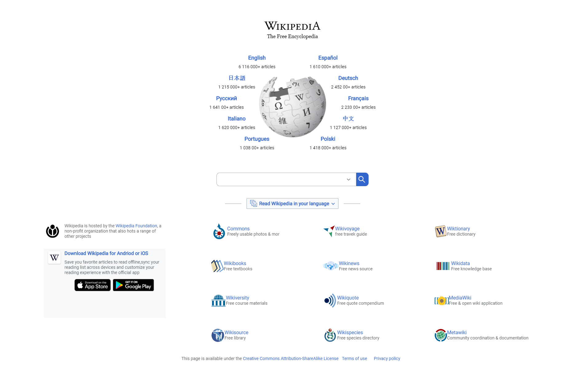

# Wikipedia main page clone

It is a challenge made by [Diego De Granda](https://github.com/degranda) for Platzi's [HTML and CSS practice course](https://platzi.com/clases/html-practico/).

### Things that were interested:

- The way that Wikipedia uses the images, basically its an only sheet with all assets that the website needs. I guess that is for better performance.

- Alway they import the same image with the attribute Linear(transparent) and change the position for each asset

- The hero looked like the most difficult part, but they use a %.

It is a little example

## Preview:

